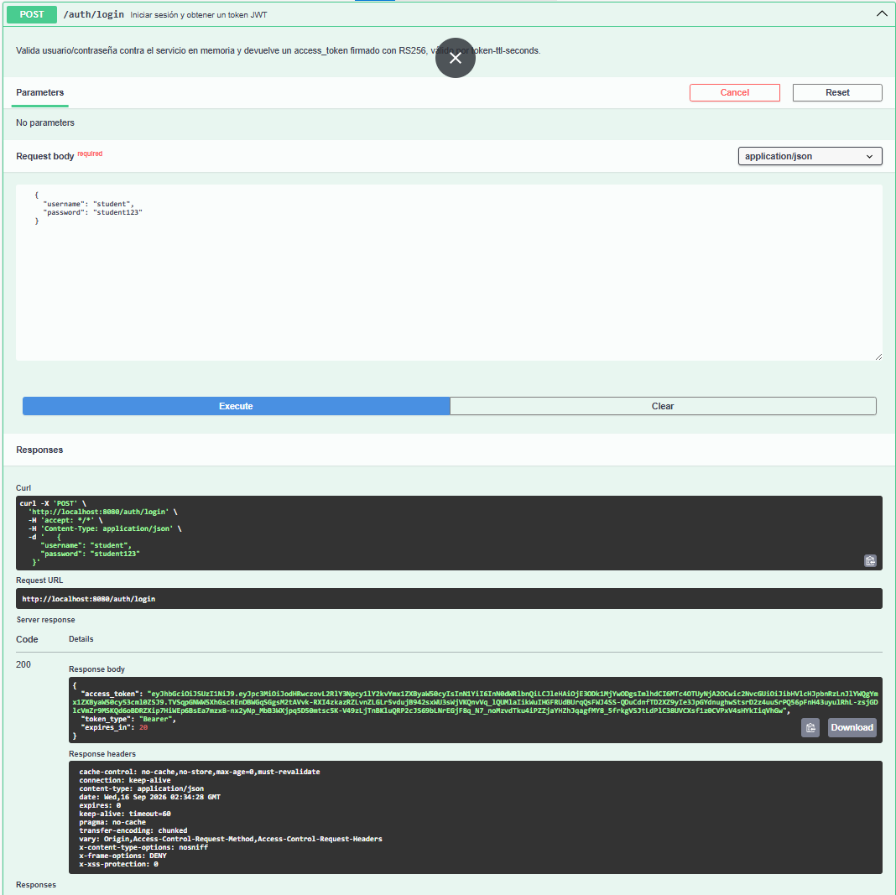
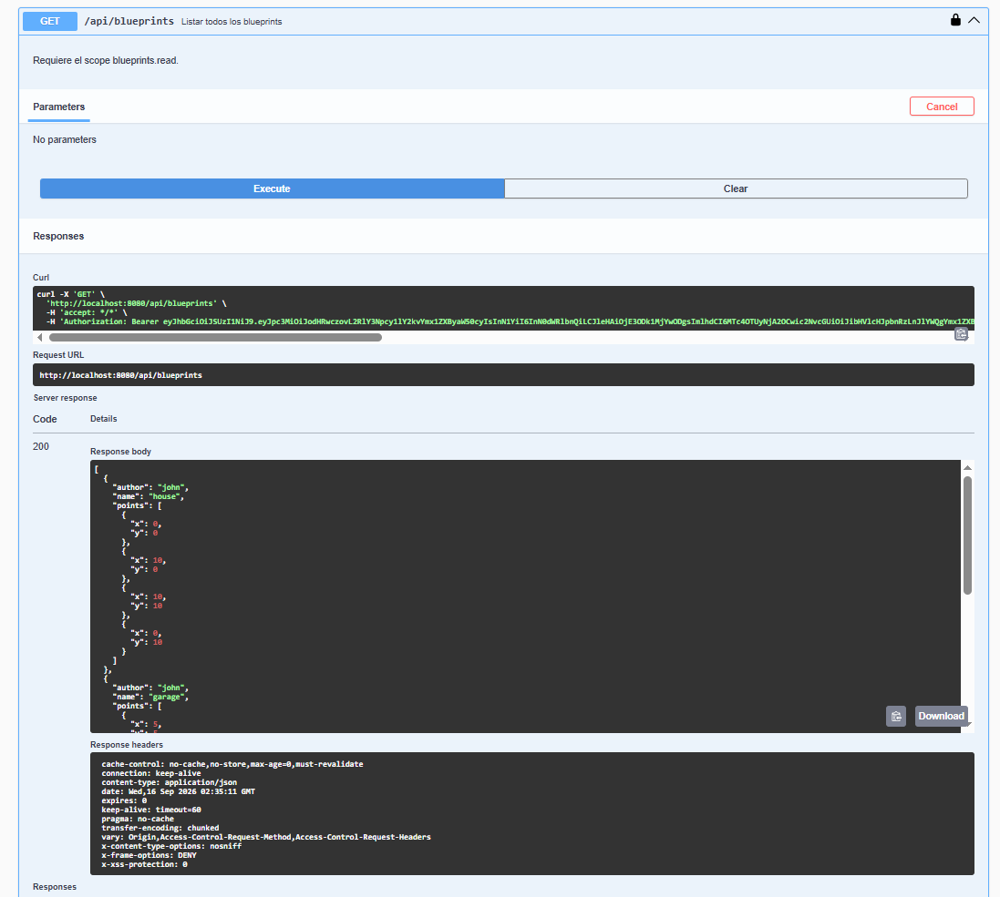
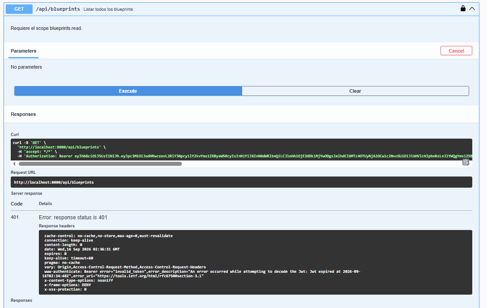
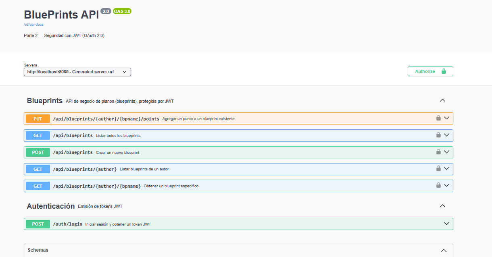
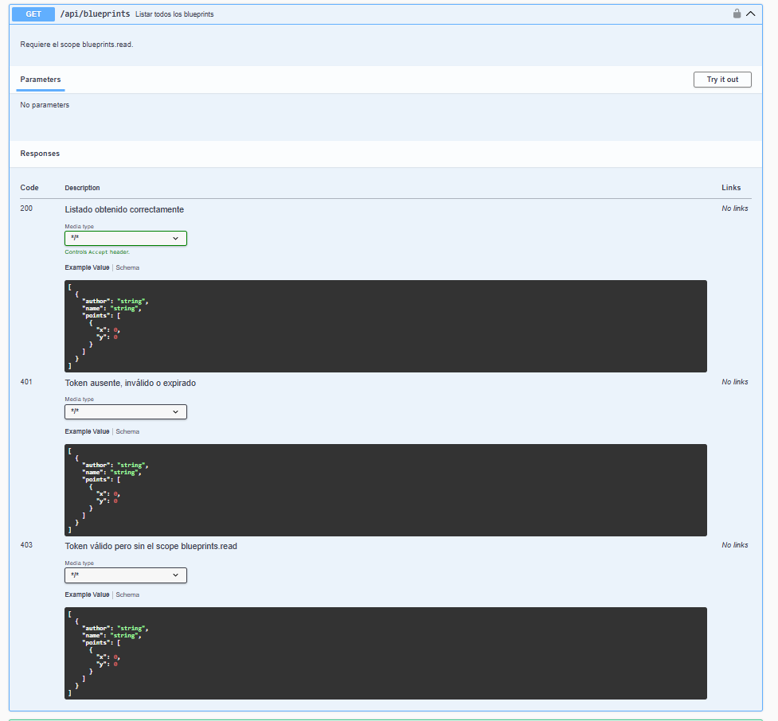

# Escuela Colombiana de Ingeniería Julio Garavito
## Arquitectura de Software – ARSW
### Laboratorio – Parte 2: BluePrints API con Seguridad JWT (OAuth 2.0)

Este laboratorio extiende la **Parte 1** ([Lab_P1_BluePrints_Java21_API](https://github.com/DECSIS-ECI/Lab_P1_BluePrints_Java21_API)) agregando **seguridad a la API** usando **Spring Boot 3, Java 21 y JWT (OAuth 2.0)**.  
El API se convierte en un **Resource Server** protegido por tokens Bearer firmados con **RS256**.  
Incluye un endpoint didáctico `/auth/login` que emite el token para facilitar las pruebas.

---

## Objetivos
- Implementar seguridad en servicios REST usando **OAuth2 Resource Server**.
- Configurar emisión y validación de **JWT**.
- Proteger endpoints con **roles y scopes** (`blueprints.read`, `blueprints.write`).
- Integrar la documentación de seguridad en **Swagger/OpenAPI**.

---

## Requisitos
- JDK 21
- Maven 3.9+
- Git

---

## Ejecución del proyecto
1. Clonar o descomprimir el proyecto:
   ```bash
   git clone https://github.com/DECSIS-ECI/Lab_P2_BluePrints_Java21_API_Security_JWT.git
   cd Lab_P2_BluePrints_Java21_API_Security_JWT
   ```
   ó si el profesor entrega el `.zip`, descomprimirlo y entrar en la carpeta.

2. Ejecutar con Maven:
   ```bash
   mvn -q -DskipTests spring-boot:run
   ```

3. Verificar que la aplicación levante en `http://localhost:8080`.

---

## Endpoints principales

### 1. Login (emite token)
```
POST http://localhost:8080/auth/login
Content-Type: application/json

{
  "username": "student",
  "password": "student123"
}
```
Respuesta:
```json
{
  "access_token": "eyJhbGciOiJSUzI1NiIsInR5cCI6IkpXVCJ9...",
  "token_type": "Bearer",
  "expires_in": 3600
}
```

### 2. Consultar blueprints (requiere scope `blueprints.read`)
```
GET http://localhost:8080/api/blueprints
Authorization: Bearer <ACCESS_TOKEN>
```

### 3. Crear blueprint (requiere scope `blueprints.write`)
```
POST http://localhost:8080/api/blueprints
Authorization: Bearer <ACCESS_TOKEN>
Content-Type: application/json

{
  "name": "Nuevo Plano"
}
```

---

## Swagger UI
- URL: [http://localhost:8080/swagger-ui/index.html](http://localhost:8080/swagger-ui/index.html)
- Pulsa **Authorize**, ingresa el token en el formato:
  ```
  Bearer eyJhbGciOi...
  ```

---

## Estructura del proyecto
```
src/main/java/co/edu/eci/blueprints/
  ├── api/BlueprintController.java       # Endpoints protegidos
  ├── auth/AuthController.java           # Login didáctico para emitir tokens
  ├── config/OpenApiConfig.java          # Configuración Swagger + JWT
  └── security/
       ├── SecurityConfig.java
       ├── MethodSecurityConfig.java
       ├── JwtKeyProvider.java
       ├── InMemoryUserService.java
       └── RsaKeyProperties.java
src/main/resources/
  └── application.yml
```

---

# Actividades propuestas - Solución

## 1. Revisar el código de configuración de seguridad (`SecurityConfig`) e identificar cómo se definen los endpoints públicos y protegidos.

**Rta:** En la clase `securityconfig.java` se definen como públicos:

- `GET/POST /actuator/health`
- `/auth/login`
- `/v3/api-docs/**`
- `/swagger-ui/**`
- `/swagger-ui.html`

Y como protegidos:

- `/api/**` que requiere alguna de las autoridades definidas como el read o el write, además, cualquier otra ruta requiere autenticación.

Y encontramos más reglas específicas:

- `GET /api/blueprints`: requiere `SCOPE_blueprints.read`.
- `POST /api/blueprints`: requiere `SCOPE_blueprints.write`.

Dichas reglas específicas están dadas por `Bluepintcontroller.java`.

---

## 2. Explorar el flujo de login y analizar las claims del JWT emitido.

**Rta:** El flujo se encuentra en `AuthController.java` de la siguiente manera:

- **a.** el cliente envia la data de login (usuario y contraseña).
- **b.** Esos datos estan grabados en memoria en `InmemoryUserservice.java` el cual valida que exista.
- **c.** Si si es valido, genera el JWT RSA firmado con RS256.
- **d.** regresa el json con el access token.
- **e.** y el JWT contiene claims como:

```json
{
  "iss": "https://decsis-eci/blueprints",
  "iat": "...",
  "exp": "...",
  "sub": "student",
  "scope": "blueprints.read blueprints.write"
}
```

### Info sacada de IA:

- **iss:** emisor configurado.
- **iat:** momento de emisión.
- **exp:** expiración, por defecto una hora.
- **sub:** nombre de usuario.
- **scope:** permisos separados por espacios. Spring Security los convierte automáticamente en `SCOPE_blueprints.read` y `SCOPE_blueprints.write`.

---

## 3. Extender los scopes (`blueprints.read`, `blueprints.write`) para controlar otros endpoints de la API, del laboratorio P1 trabajado.

**Rta:** Hecho

---

## 4. Modificar el tiempo de expiración del token y observar el efecto.

**Rta:** El tiempo de expiración no está fijo en el código: se lee desde la propiedad
`blueprints.security.token-ttl-seconds` en `application.yml`, y `AuthController` la usa
tanto para calcular el claim `exp` del JWT como para el campo `expires_in` de la respuesta.

Para observar el efecto, se bajó temporalmente el valor a 20 segundos y se hizo la siguiente prueba:

1. Se generó un token vía `POST /auth/login`, confirmando que `expires_in` refleja el nuevo valor configurado.

   

2. Se usó ese token de inmediato contra `GET /api/blueprints`, obteniendo una respuesta `200 OK`.

   

3. Se esperó a que pasaran los 20 segundos y se reutilizó el mismo token (sin generar uno nuevo) contra el mismo endpoint, obteniendo `401 Unauthorized`.

   

**Conclusión:** el rechazo del token vencido no requirió lógica adicional de nuestra parte;
lo realiza automáticamente el `JwtDecoder` (`NimbusJwtDecoder`) configurado en `SecurityConfig`,
que incluye por defecto un validador de timestamps (`exp`) sobre cualquier JWT entrante.
Una vez confirmado el comportamiento, se restauró `token-ttl-seconds` a `3600` para la entrega final.

---

## 5. Documentar en Swagger los endpoints de autenticación y de negocio.

**Rta:** Se agregaron anotaciones de OpenAPI/Swagger a los controladores:

- `@Tag` en `AuthController` ("Autenticación") y en `BlueprintsAPIController` ("Blueprints") para agrupar los endpoints en el Swagger UI.
- `@Operation` con `summary` y `description` en el endpoint de login y en los 5 endpoints de negocio (`GET /api/blueprints`, `GET /api/blueprints/{author}`, `GET /api/blueprints/{author}/{bpname}`, `POST /api/blueprints`, `PUT /api/blueprints/{author}/{bpname}/points`), indicando explícitamente qué scope requiere cada uno.
- `@ApiResponses` documentando los códigos de respuesta posibles de cada endpoint (200/201/202 según el caso, 401, 403 y 404 donde aplica).
- Se corrigió el esquema de seguridad global definido en `OpenApiConfig`: por defecto aplicaba el candado Bearer a todos los endpoints, incluyendo `/auth/login`. Se agregó `@SecurityRequirements` (vacío) en el login para reflejar que es el único endpoint público, y `@SecurityRequirement(name = "bearer-jwt")` explícito en los 5 endpoints de `/api/blueprints`.

Con esto el Swagger UI agrupa correctamente los endpoints por autenticación y negocio, muestra el candado únicamente donde corresponde, y documenta para cada endpoint de negocio qué scope necesita y qué respuestas puede devolver.



*Vista general del Swagger UI: `/auth/login` sin candado, y los 5 endpoints de `/api/blueprints` con candado.*



*Detalle de un endpoint expandido, mostrando la descripción con el scope requerido y los códigos de respuesta documentados.*

---

## Lecturas recomendadas

- [Spring Security Reference – OAuth2 Resource Server](https://docs.spring.io/spring-security/reference/servlet/oauth2/resource-server/index.html)
- [Spring Boot – Securing Web Applications](https://spring.io/guides/gs/securing-web/)
- [JSON Web Tokens – jwt.io](https://jwt.io/introduction)

---

## Licencia

Proyecto educativo con fines académicos – Escuela Colombiana de Ingeniería Julio Garavito.
